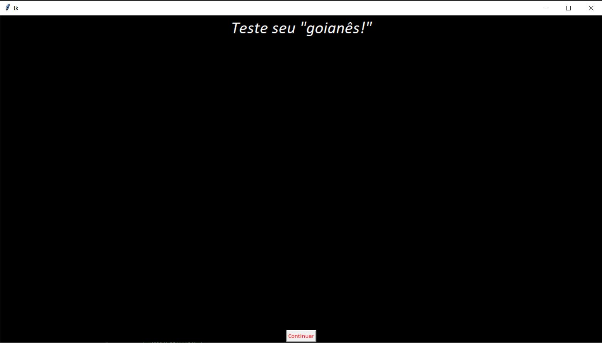
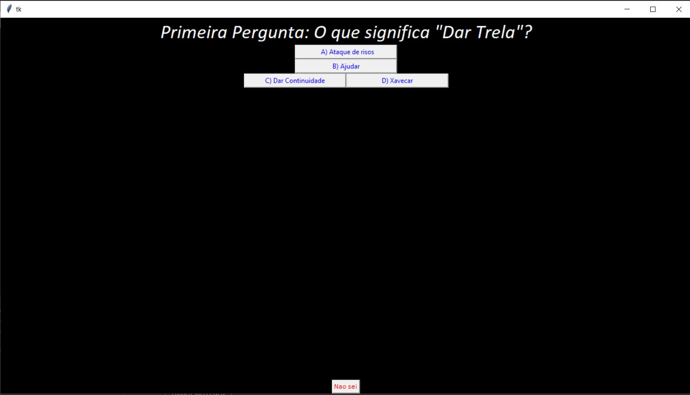
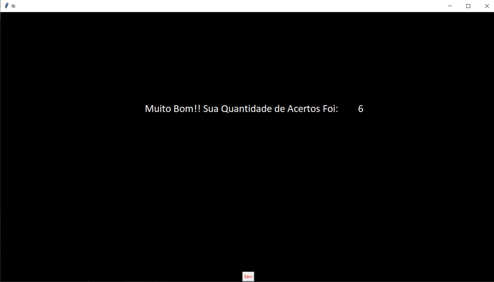
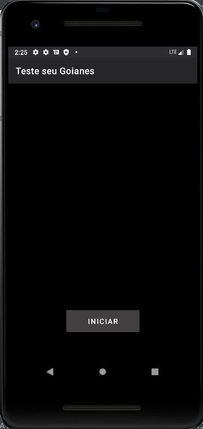
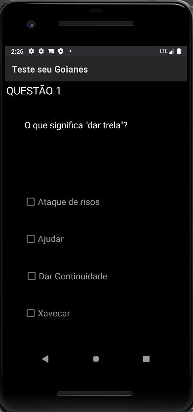
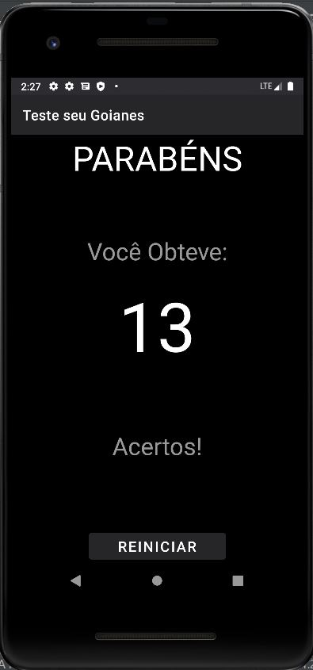

# Teste_seu_Goianes
Teste para saber o nível de conhecimento em gírias goianas

Refazendo meu primeiro programa quando estava aprendendo programação (2018).
Projeto feito na feira literária do meu antigo colégio.
Mantive o design (feio) do antigo projeto.

Versão Antiga:

Versão Nova:

